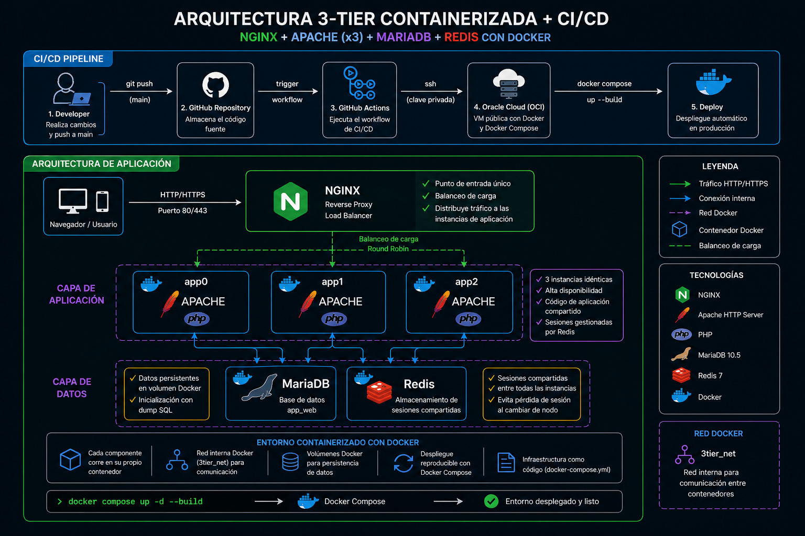
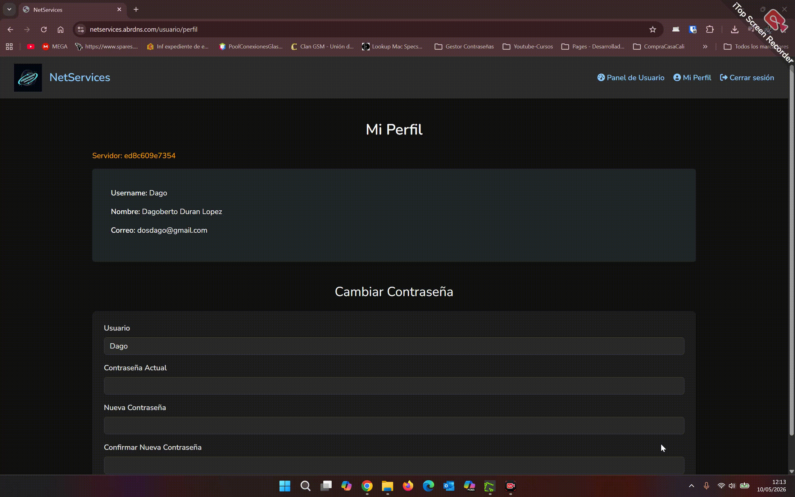

# 🚀 3-Tier Architecture Evolution: On-Prem → AWS → Containers

Arquitectura de 3 capas lista para producción utilizando NGINX, Apache (x3), MariaDB y Redis completamente contenerizada con Docker.

---

## 🔥 Características

- Balanceo de carga con NGINX
- Alta disponibilidad (3 instancias de aplicación)
- Sesiones compartidas con Redis
- Base de datos persistente (volúmenes de MariaDB)
- Entorno reproducible con Docker Compose

---

## 🏗️ Arquitectura



```text
Client → NGINX → app0/app1/app2 → MariaDB
                        ↓
                      Redis
```

## ⚡ Inicio rápido

```bash
git clone https://github.com/dakardu/3tier-container.git
cd 3tier-container
docker compose up -d --build
```

Accede en:

```text
http://localhost
```

## 🧪 Demo

- Balanceo de carga entre app0, app1 y app2
- Sesiones persistentes con Redis



## 📦 Stack tecnológico

- Docker
- Docker Compose
- NGINX
- Apache HTTP Server
- MariaDB
- Redis

## 🧩 Evolución de la arquitectura

### 🔧 On-Premise (Hyper-V)

- Infraestructura basada en máquinas virtuales
- Configuración manual
- Arquitectura monolítica

### ☁️ Cloud (AWS - Lift & Shift)

- NGINX como reverse proxy
- Cluster Apache
- Base de datos en red privada
- Redis para sesiones
- Segmentación de red (VPC)

### 🐳 Containerización (Docker)

- Migración completa a contenedores
- Docker Compose como orquestador → NGINX (HTTP → próximamente HTTPS)
- Portabilidad entre entornos
- Infraestructura como código

## 🚀 CI/CD Pipeline (Continuous Deployment)

El despliegue está automatizado utilizando GitHub Actions.

### Flujo:

1. Push a la rama `main`
2. GitHub Actions se ejecuta automáticamente
3. Generación del archivo `.env` desde secrets
4. Conexión por SSH a la VM en Oracle Cloud
5. Actualización del código (`git pull`)
6. Despliegue con Docker Compose (`up -d --build`)

### Seguridad

- Uso de claves SSH dedicadas
- Secrets gestionados en GitHub:
  - `SSH_HOST`
  - `SSH_USER`
  - `SSH_KEY`

### Variables de entorno

- Uso de `ENV_FILE` para configuración desacoplada
- Evita exponer credenciales en el repositorio
- Se genera dinámicamente en el pipeline a partir de GitHub Secrets.

## ☁️ Deployment

La aplicación está desplegada en una máquina virtual en Oracle Cloud (OCI).

- Subnet pública con acceso a Internet
- Security Lists configuradas (puertos 22, 80)
- Acceso mediante SSH
- Exposición del servicio vía Nginx

### ⚠️ Problemas reales y soluciones

- Pérdida de sesiones en entorno multi-nodo → solucionado con Redis
- Pérdida de datos al recrear contenedores → solucionado con volúmenes
- Problemas de inicialización de base de datos → solucionado con scripts de entrypoint
- Problemas de conectividad (OCI Security Lists) → apertura de puertos 80/443
- Error de permisos en apt → uso correcto de sudo
- Fallos en despliegue por falta de `.env` → solucionado con `ENV_FILE`

## Últimas mejoras implementadas

### HTTPS con Let's Encrypt
- Configuración de HTTPS usando Let's Encrypt y Certbot
- Integración de certificados SSL dentro de la arquitectura Docker
- Ajustes en `docker-compose.yml` para certificados y volúmenes
- Configuración de `nginx.conf`:
  - Redirección automática HTTP → HTTPS
  - Cabeceras de seguridad SSL
- Apertura del puerto `443` en OCI Security Lists

### Despliegue automatizado en AWS
- Creación y preparación de una instancia EC2 en AWS
- Conexión remota mediante SSH usando claves `.pem`
- Actualización del sistema e instalación de dependencias:
  - Docker
  - Docker Compose
  - Git
  - Curl
  - Certbot y utilidades necesarias
- Configuración de secretos en GitHub Actions:
  - `AWS_SSH_HOST`
  - `AWS_SSH_USER`
  - `AWS_SSH_KEY`
- Implementación de un nuevo job de despliegue automático para AWS
- Despliegue multi-cloud desde un único workflow CI/CD
- Verificación de funcionamiento correcto en OCI y AWS

## 🚀 Próximos pasos

- Añadir healthchecks a los servicios
- Implementar observabilidad con Prometheus y Grafana
- Pipeline CI/CD con testing automático
- Escalado horizontal con Docker Swarm o Kubernetes
- Balanceo de carga entre múltiples nodos
- Automatización de backups de MariaDB
